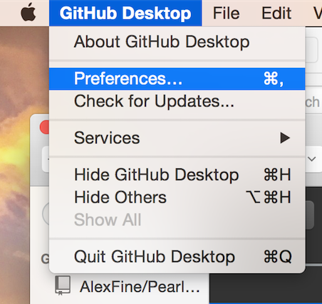
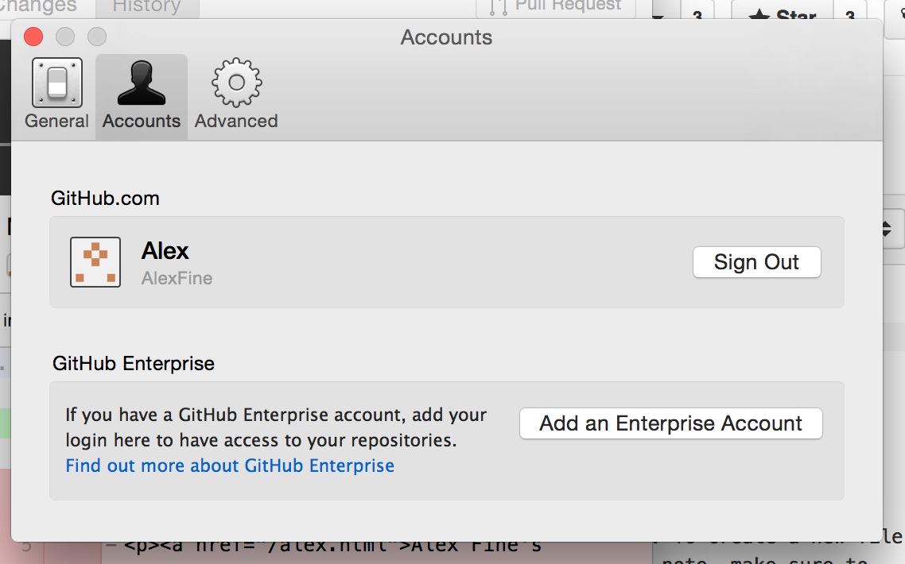
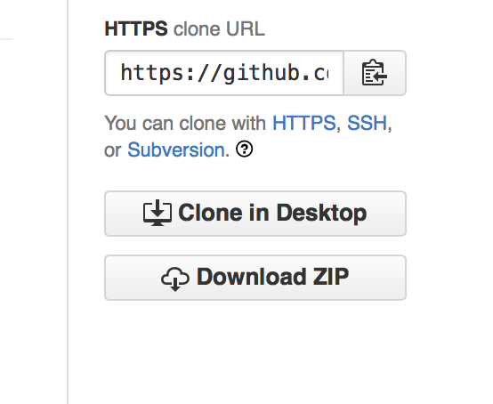
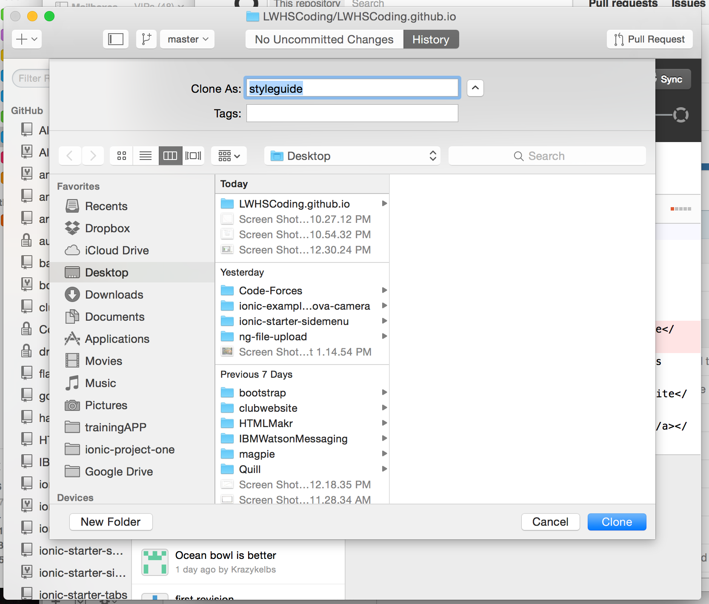
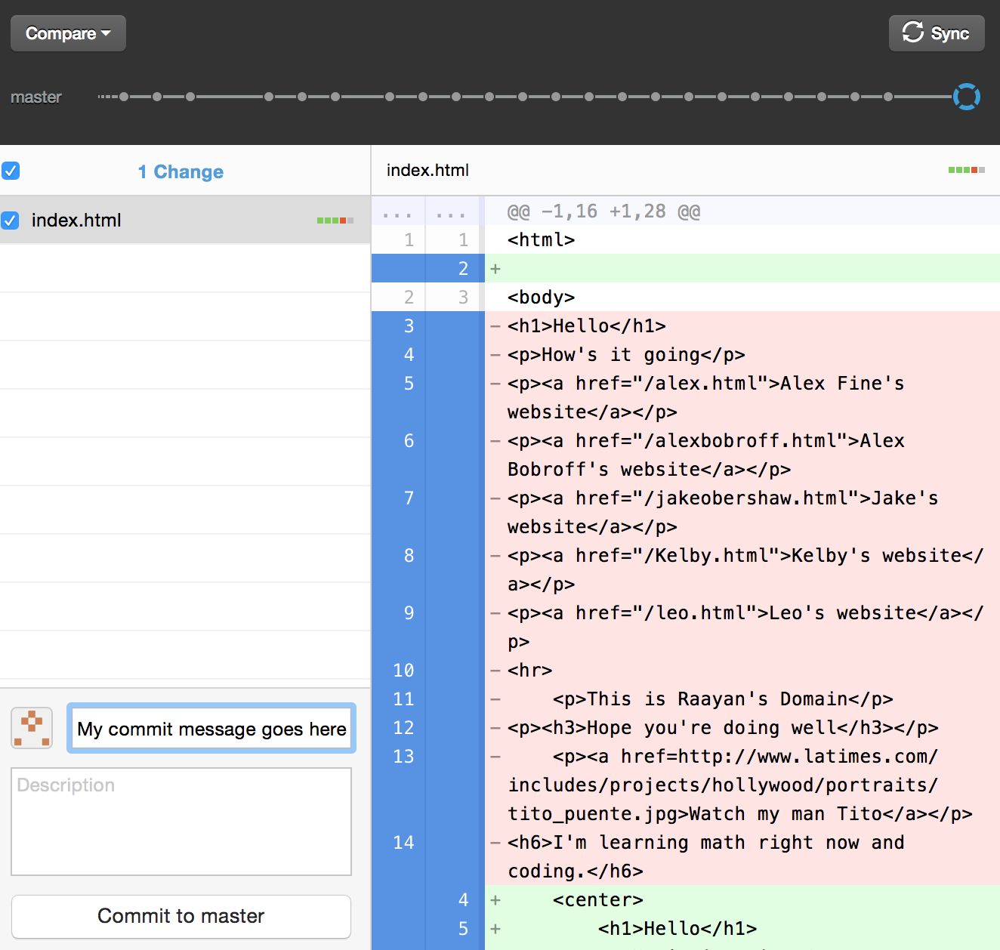
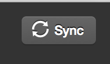

To start the coding process, you first need the code on your computer. Make sure you have the Github desktop app installed and you’ve successfully logged in (if you’re having trouble logging in click preferences —> account —> enter your info). 

Now to actually get the code, click “clone to desktop” on the repository page (<a href="https://github.com/LWHSCoding/LWHSCoding.github.io">https://github.com/LWHSCoding/LWHSCoding.github.io</a> ). This will store the code to your computer. When you’re saving the repo folder it will ask you where you want to store it on your computer, make sure you select a place you remember! I personally put everything on my desktop. 

Once you have your code you have two options. Either create a new file or edit an existing file. To create a new file simply go into brackets, type “Command N” and store your file to your repo folder. An important note, make sure to store the file to the actual repository folder and not just to a Github folder. If you store it to the Github folder you won’t be able to push back to the repository. So, make sure your new file is in the repository file. To edit the code of an existing website (feel free to check out and edit the code of my website btw) just open that file in brackets and edit away. 

After you’ve made your changes you can view them in the Github app. If your changes did not appear it’s likely you did not either a) save your files b) add it to the correct folder c) are viewing the wrong thing or d) simply imagined coding your website. 

Lastly, make sure to commit your changes. If you don't commit <b>AND SYNC </b> you're changes will not show up.
 

Also, everyone should try to improve our index.html (the home page). I think it would be an awesome testament to what we’ve done so far if all the club members came together to design the website. 

